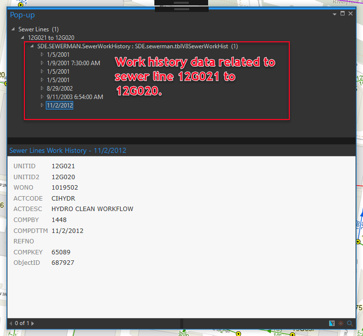

---

---

# **ArcGIS-Pro-AddWorkHistTables**  

Unlike in ArcMap, ArcGIS Pro will **NOT**, as of release **2.2.3**, let you read related data from a relationship class unless the related table is added to the map. This ArcGIS Pro add-in was developed overcome this by adding the **Sewer Lines Work History** and **Manholes Work History** tables and set the **DisplayField** property for each table so users can view rows by completed date in the pop-up.

This tool is also apart of the larger [LRWRA add-in](https://github.com/dogwoodgeo/ArcGIS-Pro-LRWRA) 

**Note**: I am a novice .Net developer, at best.  The add-in works, but feel free to let me know if you see any code that is "wrong" or just plain bad.  

## Getting Started

Clone or download the repository. Open Visual Studio 2015 or 2017, build solution, launch ArcGIS Pro and check the **Add-Ins** tab.


### Prerequisites

```
Language:				C#
Contributor:			Bradley Jones, bjones@dogwoodgeo.com
Organization:			Little Rock Water Reclamation Authority (LRWRA)
Org Site: 				https://git.lrwu.com/portal
Date:					10/31/2018
ArcGIS Pro:				2.2
ArcGIS Pro SDK: 		2.2
Visual Studio: 			2017, 2015
.NET Target Framework:	4.6.1
```

### How To Use Add-In

1. Build add-in (see **Getting Started**)

2. Launch ArcGIS Pro.

3. Go to **Add-In** tab.

4. Click on the **Add Work History Tables** button,

5. The **Manholes Work History** and **Sewer Lines Work History** tables will be added to the map, if they are not already present. If they are present, you will receive a message reminding you of such.

   

6. Related data can now be viewed in the default pop-up. Use Up/Down arrow keys to scroll through dates.

   


